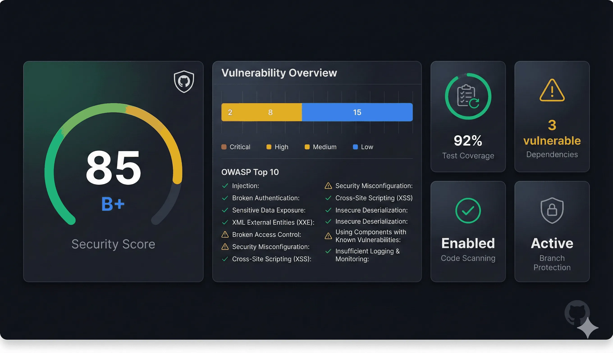

# TopFlow: Scan Any GitHub Repo's Security Posture in 30 Seconds

<div align="center">

[](https://topflow.dev/builder?template=github-security-scanner)
[](https://github.com/csupenn/topflow/stargazers)
[](LICENSE)



**Built by a former CISO. No signup. No API keys. Instant results.**

[Scan facebook/react →](https://topflow.dev/builder?template=github-security-scanner&repo=facebook/react) • [Interactive Showcase](https://topflow.dev/showcase/security-scanner) • [How It Works](https://topflow.dev/docs)

</div>

---

## Example: Scanning facebook/react

**Score: 95/100 (A+)**

| Area | Result |
|------|--------|
| Security controls | Security policy, code scanning, Dependabot, branch protection, secret scanning |
| Vulnerabilities | 0 critical · 1 high · 3 medium · 7 low |
| OWASP coverage | 8 of 10 controls passing |
| Recommendations | Add GPG commit signing · expand SAST coverage |

**[Scan your own repo →](https://topflow.dev/builder?template=github-security-scanner)**

---

## What You Get

| | |
|---|---|
| **Security analysis** | OWASP Top 10 checks, vulnerability severity, dependency risk, branch protection |
| **Actionable guidance** | Prioritized fixes with effort estimates and impact notes |
| **Shareable outputs** | Markdown reports, JSON data, social cards |
| **Live badge API** | Auto-updating security score badge for your README |

**Add a live badge to your project:**

```markdown
[](https://topflow.dev/showcase/security-scanner)
```

| Repository | Badge |
|------------|-------|
| facebook/react | [](https://topflow.dev/showcase/security-scanner) |
| aquasecurity/trivy | [](https://topflow.dev/showcase/security-scanner) |
| django/django | [](https://topflow.dev/showcase/security-scanner) |

---

## Security You Can Trust

The scanner runs on **TopFlow** — a privacy-first AI workflow platform built with enterprise-grade security architecture.

| | |
|---|---|
| **Zero data storage** | All analysis is client-side. Your workflows and API keys never touch our servers. |
| **BYOK model** | Bring your own AI provider keys, or use demo mode without any keys at all. |
| **5-layer defense** | Input sanitization → TLS 1.3 → rate limiting → SSRF prevention → sandboxed execution |
| **Open source** | MIT licensed. Audit the code, fork it, own it. |

**How TopFlow compares:**

| | TopFlow | Other platforms |
|---|---|---|
| Data storage | None (localStorage only) | Cloud databases |
| API keys | Your own (BYOK) | Platform-managed |
| Code export | Production TypeScript | JSON/config only |
| Vendor lock-in | None | Proprietary formats |
| Cost | Free | Monthly subscriptions |
| Built by | Former CISO | SaaS companies |

---

## 8 Pre-Built Security Templates

The GitHub Scanner is one of eight ready-to-run workflows:

<table>
<tr>
<td align="center"><a href="https://topflow.dev/builder?template=github-security-scanner">🔍<br/><b>GitHub Security Scanner</b><br/><sub>Repository security analysis</sub></a></td>
<td align="center"><a href="https://topflow.dev/builder?template=gdpr-data-access">🛡️<br/><b>GDPR Compliance</b><br/><sub>Data access request automation</sub></a></td>
<td align="center"><a href="https://topflow.dev/builder?template=pii-detection">🔐<br/><b>PII Detection</b><br/><sub>Privacy-preserving pipeline</sub></a></td>
</tr>
<tr>
<td align="center"><a href="https://topflow.dev/builder?template=incident-response">🚨<br/><b>Incident Response</b><br/><sub>SOC automation with AI</sub></a></td>
<td align="center"><a href="https://topflow.dev/builder?template=soc2-evidence">📋<br/><b>SOC 2 Evidence</b><br/><sub>Audit trail generation</sub></a></td>
<td align="center"><a href="https://topflow.dev/builder">⚙️<br/><b>Build Your Own</b><br/><sub>Visual workflow editor</sub></a></td>
</tr>
</table>

All templates include demo mode, TypeScript export, and a visual workflow editor.

---

## Quick Start

**Try instantly (no install):**
```
https://topflow.dev/builder?template=github-security-scanner&repo=YOUR_USERNAME/YOUR_REPO
```

**Run locally:**
```bash
git clone https://github.com/csupenn/topflow.git
cd topflow && pnpm install && pnpm dev
# Open http://localhost:3000
```

---

## Tech Stack

Next.js 15 · React 19 · TypeScript · TailwindCSS v4 · ReactFlow · Vercel AI SDK v5 · shadcn/ui · Zustand

**AI providers:** OpenAI · Anthropic · Google · Groq

---

## Documentation

- [Architecture Overview](docs/architecture/architecture-overview.md) — System design & security model
- [Security Docs](https://topflow.dev/docs/security) — Threat model & controls
- [Node Reference](https://topflow.dev/docs/build/nodes) — All 12 node types
- [AI Security Tutorials](docs/AI-Security/osv-scanner/README.md) — Hands-on case studies from real hardening work (SSRF, encryption, rate limiting, LLM constraints); published at [topflow.dev/blog](https://topflow.dev/blog)

---

## Contributing

Security improvements, compliance workflows, new node types, and test coverage are especially welcome. See [CONTRIBUTING.md](CONTRIBUTING.md).

**License:** MIT — use, modify, fork, and distribute freely.

---

<div align="center">
<sub>Built by <a href="https://charliesu.com">Charlie Su</a> · Former CISO · AI Security Advocate</sub><br/>
<sub>📧 <a href="mailto:charlie@topflow.dev">charlie@topflow.dev</a> · 💼 <a href="https://linkedin.com/in/charliesu">LinkedIn</a> · <a href="https://github.com/csupenn/topflow/issues">Issues</a> · <a href="https://github.com/csupenn/topflow/discussions">Discussions</a></sub>
</div>
