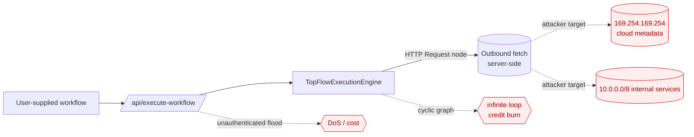

# Tutorial 01 — Securing Workflow Egress & Execution: SSRF Allowlisting, Cycle Detection, and Rate Limiting

| | |
|---|---|
| **Series** | AI Security Tutorials — TopFlow |
| **Level** | Intermediate |
| **Source PR** | #12 (`feat(security): SSRF guard + cycle detection + rate limiter (M1 P0)`) |
| **Files** | `lib/security/ssrf.ts`, `lib/security/workflow-graph.ts`, `lib/security/rate-limit.ts`, `lib/topflow-execution-engine.ts`, `app/api/execute-workflow/route.ts` |
| **Status** | Draft — 2026-06-14 |
| **Est. time** | 60–90 min (with labs) |

### Learning objectives
By the end you can: (1) explain SSRF, execution-graph DoS, and resource-exhaustion in the context of an
LLM workflow engine; (2) build a threat model and attack trees for a server-side "agent" that fetches
URLs on a user's behalf; (3) justify allowlist vs. blocklist, fail-closed placement, and sliding-window
limiting; (4) read and critique the production implementation, including what it deliberately leaves open.

---

## 1. Context & architecture

TopFlow lets users compose **workflows** from nodes (start, httpRequest, textModel, javascript, …) and
runs them server-side at `POST /api/execute-workflow` via `TopFlowExecutionEngine`. One node type — the
**HTTP Request node** — fetches an arbitrary URL **from the server**. That single capability turns the
engine into a *confused deputy*: the server makes outbound requests chosen by (untrusted) user input.

This is the classic precondition for **SSRF (Server-Side Request Forgery)**. Combine it with two other
realities of a workflow engine:
- the workflow is a **directed graph** the user controls → a **cycle** can loop execution forever;
- the endpoint is **public and unauthenticated** → it can be **hammered** for DoS or cost.



PR #12 adds three controls at exactly these points: an **SSRF egress guard** on the outbound fetch, a
**fail-closed cycle check** before execution, and a **rate limiter** on the route.

## 2. Security mechanisms (the concepts)

- **SSRF egress filtering.** Before the server fetches a user-controlled URL, validate the *destination*.
  Two philosophies: **blocklist** (deny known-bad: private ranges, metadata IP) vs **allowlist** (permit
  only known-good hosts). Allowlists are stronger but brittle for a general fetch node; this PR uses a
  strict blocklist of non-routable/private space plus a scheme allowlist (`http`/`https` only).
- **Cycle detection (availability).** A workflow is a graph; executing a graph with a directed cycle can
  loop forever. Detect cycles **before** running and **fail closed** (refuse to execute).
- **Rate limiting (availability & cost).** Bound how often a client can call an expensive endpoint.
  A **sliding window** counts requests in the trailing N seconds (smoother than a fixed window that
  resets on a boundary and allows 2× bursts).

Each is a different leg of the **CIA triad**: SSRF → confidentiality/integrity of internal systems;
cycles & rate limits → availability (and, for an AI product, **API-credit cost**, which is availability's
wallet-shaped cousin).

## 3. Threat model (for this architecture)

**Assets:** cloud instance metadata (IAM creds via `169.254.169.254`), internal/private services
(databases, admin panels on `10/172.16-31/192.168`), the user's BYOK secrets in process memory, server
availability, and AI-provider credits.

**Trust boundary:** the `POST /api/execute-workflow` request body is **fully attacker-controlled**
(nodes, edges, URLs). Everything past it runs with the **server's** network position and privileges.

**Entry points:** the HTTP Request node's `url`/`method`/`headers`/`body`; the workflow graph (`nodes`,
`edges`); the request itself (volume).

**STRIDE for the HTTP node + engine:**

| STRIDE | Threat in this system |
|---|---|
| **S**poofing | Server identity used to reach internal services that trust the VPC. |
| **T**ampering | — (read-mostly here) |
| **R**epudiation | Unauthenticated floods are hard to attribute (mitigated by per-IP keying + logs). |
| **I**nfo disclosure | **SSRF → cloud metadata / internal endpoints** (the headline risk). |
| **D**enial of service | **Cyclic graph** (infinite loop) and **endpoint flooding**. |
| **E**levation of privilege | Metadata creds → lateral movement / IAM escalation. |

Mapped to the LLM-app canon: SSRF + DoS sit under **OWASP LLM06 (Excessive Agency)** and the classic
**OWASP API/Web SSRF**; cost-via-loops connects to **Unbounded Consumption**.

## 4. Attack trees

**Attack tree A — Reach internal/metadata via the HTTP node**
```
GOAL: make the server fetch an internal/metadata target
├── A1 direct private IP            (http://10.0.0.5/admin)            [blocked: isBlockedIpv4]
├── A2 cloud metadata IP            (http://169.254.169.254/…)         [blocked: link-local /16]
├── A3 loopback                     (http://127.0.0.1:3000/…)          [blocked: 127/8]
├── A4 IPv6 loopback / ULA          (http://[::1]/, fd00::/fe80::)     [blocked: isBlockedIpv6]
├── A5 IPv4-mapped IPv6             (http://[::ffff:10.0.0.1]/)        [blocked: mapped→v4 check]
├── A6 alternate scheme             (file://, gopher://)               [blocked: scheme allowlist]
├── A7 internal hostname            (db.internal, svc.local)           [blocked: .internal/.local]
├── A8 abuse engine internal route  (relative "/api/…")                [EXEMPT by design — see §5]
└── A9 DNS rebinding                 (evil.com → resolves to 10.x)      [NOT fully closed — residual risk]
```

**Attack tree B — Exhaust the system**
```
GOAL: deny service / burn credits
├── B1 cyclic workflow              (a→b→c→a, or self-loop a→a)        [blocked: detectWorkflowCycle, fail-closed]
└── B2 flood the endpoint           (N requests/sec from one client)   [throttled: sliding-window limiter]
        └── B2a rotate source IPs                                       [partial: per-IP only; per-token & WAF future]
```

The leaves marked *blocked* map 1:1 to code in §6. The two unclosed leaves (**A9 DNS rebinding**,
**B2a IP rotation**) are the honest edges of this PR and are called out as residual risk — a recurring
theme in security: *you ship the high-value mitigations and document the remainder.*

## 5. Design considerations (decisions & trade-offs)

1. **Blocklist, not allowlist — for now.** A general HTTP node must reach arbitrary public APIs, so a
   host allowlist would break the feature. We blocklist non-routable space + restrict schemes. (A
   per-workflow *allowlist* is a sensible future opt-in for high-assurance deployments.)
2. **Exempt engine-generated relative routes (the critical nuance).** The scanner calls its own API as a
   *relative* path (`/api/scan/github/…`), which the engine rewrites to `localhost`. If the SSRF guard
   blocked loopback indiscriminately, **it would break the product's own real-scan path.** So the guard
   is applied **only to user-supplied absolute URLs**; engine-issued relative routes are trusted. This
   is the key design insight: *the same destination (localhost) is allowed or denied based on
   provenance, not just value.* The risk it introduces — a user typing an absolute `http://localhost…` —
   is itself caught (absolute → checked → blocked).
3. **Hostname/literal-IP check vs. full DNS resolution.** Resolving DNS and checking the *resolved* IP
   (with pinning) defeats DNS rebinding but adds latency, complexity, and its own pitfalls in serverless.
   We ship the high-coverage literal check now and document rebinding as defense-in-depth follow-up.
4. **Fail closed, and early.** Cycle detection runs in the route **before** the engine starts and
   refuses to execute on any cycle — independent of the workflow-core library's own validation (defense
   in depth). A returned cycle *path* makes the error actionable.
5. **Sliding window + pluggable store.** Sliding-window beats fixed-window burst-doubling. The store is
   an interface (`RateLimitStore`); the default is in-memory (per instance), with a documented
   Redis/Vercel-KV adapter as the durability follow-up. We deliberately **did not add a dependency**
   (the repo's CI uses a frozen lockfile), trading cross-instance durability now for a clean, testable,
   shippable increment.
6. **Per-IP keying (with token support ready).** The execute route keys by client IP (the token lives in
   the body, read once downstream). `rateLimitKey(ip, token?)` already supports per-token limiting for
   header-token routes, and **hashes** the token so secrets never appear in keys/logs.

## 6. Implementation case study (PR #12)

**SSRF guard — `lib/security/ssrf.ts`.** Pure, dependency-free, unit-testable. Literal-IP range checks +
scheme allowlist:
```ts
function isBlockedIpv4(ip: string): boolean {
  const [a, b] = ip.split(".").map(Number)
  if (a === 10) return true                          // 10/8 private
  if (a === 127) return true                         // 127/8 loopback
  if (a === 169 && b === 254) return true            // 169.254/16 link-local (cloud metadata)
  if (a === 172 && b >= 16 && b <= 31) return true   // 172.16/12 private
  if (a === 192 && b === 168) return true            // 192.168/16 private
  if (a === 100 && b >= 64 && b <= 127) return true  // 100.64/10 CGNAT
  if (a >= 224) return true                           // multicast/reserved
  return false
}
export function checkOutboundUrl(rawUrl: string): SsrfCheck {
  let u: URL; try { u = new URL(rawUrl) } catch { return { safe: false, reason: `invalid URL` } }
  if (u.protocol !== "http:" && u.protocol !== "https:") return { safe: false, reason: "blocked scheme" }
  if (isBlockedHost(u.hostname)) return { safe: false, reason: "blocked host" }
  return { safe: true }
}
```

**Engine integration — `lib/topflow-execution-engine.ts`.** The guard runs after interpolation, right
before `fetch`, and *only* for absolute URLs (the provenance rule from §5.2):
```ts
let finalUrl = interpolatedUrl
if (interpolatedUrl.startsWith('/')) {
  finalUrl = `${process.env.NEXT_PUBLIC_BASE_URL || 'http://localhost:3000'}${interpolatedUrl}` // trusted internal route
} else {
  assertSafeOutboundUrl(finalUrl) // SSRF guard — user-supplied absolute URLs only
}
```

**Cycle detection — `lib/security/workflow-graph.ts`.** DFS three-color coloring; returns the cycle path:
```ts
// GRAY = on the current DFS stack; a back-edge to a GRAY node is a cycle
if (color.get(next) === GRAY) { const start = stack.indexOf(next); return stack.slice(start).concat(next) }
```
Wired fail-closed in the route **before** execution:
```ts
const cycleCheck = detectWorkflowCycle(sanitizedNodes, edges)
if (cycleCheck.hasCycle) { sendUpdate({ type: "error", error: `Workflow contains a cycle (${cycleCheck.cycle?.join(" → ")})…` }); controller.close(); return }
```

**Rate limiting — `lib/security/rate-limit.ts`.** Sliding-window log + injectable clock (for tests) +
pluggable store; the route returns standard headers:
```ts
const hits = await this.store.hit(key, now, this.windowMs)   // timestamps within trailing window
return { allowed: hits.length <= this.limit, remaining: Math.max(0, this.limit - hits.length), … }
```
```ts
const rl = await limiter.check(rateLimitKey(clientIp))
if (!rl.allowed) return new Response(JSON.stringify({error:"Rate limit exceeded…"}),
  { status: 429, headers: { "Retry-After": String(Math.ceil(rl.resetMs/1000)), "X-RateLimit-Remaining": String(rl.remaining) } })
```

**Testing.** Each module ships Jest unit tests (`lib/security/__tests__/`): SSRF block/allow tables
(incl. `172.32.0.1` *allowed* — just outside the /12 — to catch off-by-one range bugs), cycle/DAG/self-
loop cases, and a clock-injected limiter (allow N, block N+1, reset after the window). The logic was
also exercised end-to-end locally (30/30 assertions) before CI.

**Deliberately deferred** (and documented, not hidden): DNS-rebinding resolution, cross-instance durable
rate-limit store (needs a dep), and the JS-node sandbox replacement (separate W1 slice).

## 7. Hands-on labs

> Run locally: `pnpm install && pnpm dev`. Unit tests: `pnpm test`.

1. **Confirm the metadata block.** Build a workflow with an HTTP node targeting
   `http://169.254.169.254/latest/meta-data/iam/security-credentials/`. Run it; confirm it's rejected.
   Now point it at `https://api.github.com/repos/facebook/react` — confirm it succeeds. *Why does the
   scanner's own `/api/scan/github` call still work?* (See §5.2.)
2. **Off-by-one hunt.** In `ssrf.test.ts`, add cases for `172.16.0.0`, `172.31.255.255` (blocked) and
   `172.15.255.255`, `172.32.0.1` (allowed). Break the range check on purpose and watch the tests fail.
3. **Fail-closed cycles.** Submit `a→b→c→a`; observe the error includes the cycle path. Then a self-loop
   `a→a`. Then a valid DAG — confirm it runs.
4. **Rate-limit headers.** Hit the endpoint 11× quickly; observe the `429` + `Retry-After` /
   `X-RateLimit-Remaining`. Change `limit`/`windowMs` and re-observe.
5. **Red-team (stretch).** Write `evil.example` DNS that resolves to `127.0.0.1`, point the HTTP node at
   it, and show the literal check **doesn't** stop it (A9). Then sketch a fix (resolve + check resolved
   IP + pin). Discuss the latency/complexity trade-off.

**Discussion:** Where else in this app does untrusted input choose a side effect? (Hint: the
`javascript`/`tool` node's `new Function` — a future tutorial.) Should rate limits be per-IP, per-token,
or both — and what breaks each?

## 8. Takeaways, mappings & further reading

- **Untrusted input that selects a server side effect is the root pattern** behind SSRF *and* excessive
  agency. Validate the *destination/action*, not just the *content*.
- **Provenance can be a security property:** the SSRF exemption shows the same value (localhost) is safe
  or unsafe depending on who supplied it.
- **Fail closed, ship the 80%, document the residual** (DNS rebinding, IP rotation) instead of pretending.

| Control | CWE | OWASP |
|---|---|---|
| SSRF guard | CWE-918 (SSRF) | A10:2021 SSRF · LLM06 Excessive Agency |
| Cycle detection | CWE-835 (infinite loop) | Unbounded Consumption |
| Rate limiting | CWE-770 (alloc w/o limits) | API4:2023 Unrestricted Resource Consumption |

**Further reading:** PortSwigger Web Security Academy — SSRF; OWASP SSRF Prevention Cheat Sheet; OWASP
Top 10 for LLM Applications (LLM06); NIST AI 600-1; the companion `urw-llm-pipeline-design.md`.
