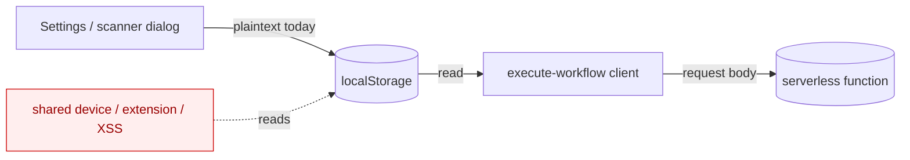

# Tutorial 02 — Secrets at Rest: BYOK Key Encryption in a Zero-Backend App

| | |
|---|---|
| **Series** | AI Security Tutorials — TopFlow |
| **Level** | Intermediate |
| **Source** | W1 key-encryption hardening (`lib/security/encryption.ts` + client wiring) |
| **Files** | `lib/security/encryption.ts`, `components/api-settings-dialog.tsx`, `components/workflow-input-dialog.tsx`, `components/execution-panel.tsx` |
| **Status** | Draft — 2026-06-14 |
| **Est. time** | 45–75 min (with labs) |

### Learning objectives
(1) Reason about **encryption at rest** vs in-transit vs in-use; (2) threat-model **BYOK secrets** in a
no-backend, localStorage-first app; (3) understand the **key-custody spectrum** and why a client-held
key has hard limits; (4) read a real bug-and-fix (AES-GCM with an *ephemeral* key) and a
backward-compatible migration; (5) state honestly what this control does and does **not** stop.

---

## 1. Context & architecture

TopFlow is **BYOK (bring your own key)** and deliberately has **no backend datastore** — its privacy
pitch is "your keys never leave your browser / are never stored on our servers." Two kinds of secret
live in the browser's `localStorage`:
- **AI provider keys** (`ai-agent-api-keys`: OpenAI/Anthropic/Google/Groq) — entered in the API
  Settings dialog.
- **GitHub token** (`ai-agent-github-token`) — entered in the scanner's input dialog (Tutorial 01's
  BYOK scan-data axis).

Both were stored **in plaintext**. On execution they're read from `localStorage` and POSTed in the
`/api/execute-workflow` body.



This tutorial adds **encryption at rest** for both secrets — and, just as importantly, is precise
about the threat it does and doesn't address.

## 2. Security mechanism (the concept)

**Encryption at rest** protects data while it sits in storage. We use **AES-256-GCM** (authenticated
symmetric encryption) via the browser-native **Web Crypto API** (`crypto.subtle`). GCM gives
confidentiality **and** integrity (a tampered ciphertext fails to decrypt). Each value uses a random
**96-bit IV**, and the stored format is `encrypted:<base64(iv || ciphertext)>`.

The hard part of any encryption scheme is **key management** — *where does the key live, and who can
reach it?* That question, not the cipher, decides how much protection you actually get (see §5).

## 3. Threat model (for this architecture)

**Asset:** the user's BYOK secrets (AI keys, GitHub token) — long-lived, high-value credentials.

**Trust boundaries:** (a) other code/users with access to the same browser profile (extensions, shared
devices, another tab/script via XSS); (b) the network (TLS handles this); (c) the serverless function
(keys transit it on live runs — a *separate* concern, see §5.6).

**STRIDE (storage-focused):**

| STRIDE | Threat |
|---|---|
| **I**nfo disclosure | Plaintext keys readable from `localStorage` by a shared-device user, a malicious browser extension, or injected script. **(primary)** |
| **T**ampering | Swapped/poisoned stored key → GCM detects on decrypt (auth tag). |
| **R**epudiation / **S**poofing / **E**oP / **D**oS | Out of scope for at-rest storage here. |

Mappings: **CWE-312 Cleartext Storage of Sensitive Information**, **CWE-522 Insufficiently Protected
Credentials**, **CWE-320 Key Management Errors**.

## 4. Attack trees

```
GOAL: steal the user's BYOK secrets from the browser
├── T1 read plaintext localStorage directly
│     ├── T1a shared/kiosk device, victim left logged in     [raised: now ciphertext at rest]
│     ├── T1b malicious browser extension reading storage     [raised: ciphertext, key separate-ish]
│     └── T1c casual inspection / screen-share of devtools    [raised: ciphertext, not plaintext]
├── T2 exfiltrate via injected script (XSS)
│     └── T2a script reads BOTH ciphertext AND the key        [NOT stopped — key is in the page origin]
├── T3 intercept in transit                                   [out of scope: TLS]
└── T4 read on the server                                     [separate concern: keys transit serverless; not stored]
```

The decisive honesty: **encryption at rest raises the bar for T1 (at-rest exposure) but does NOT stop
T2 (XSS)** — because the decryption key necessarily lives in the same origin the attacker's script
runs in. Teaching this distinction is the whole point: *don't let "we encrypt it" become security
theater.* The real XSS mitigations are elsewhere (CSP, input/output handling, the URW boundary).

## 5. Design considerations (the key-custody spectrum)

| Option | Protects against | Cost / downside |
|---|---|---|
| Static app key (in bundle) | Almost nothing (key is public) | Security theater — avoid |
| **Persisted random key in localStorage** ← *what we ship* | Casual at-rest inspection, some extension/exfil cases | Not XSS-proof (key co-located) |
| User-passphrase-derived key (PBKDF2/Argon2) | At-rest + many XSS-exfil cases (key not stored) | UX cost: prompt to unlock each session |
| Server-side custody / secrets vault | The strongest | Breaks the zero-backend / privacy promise |

Decisions made:
1. **Persisted random key**, not static or server. It fits the privacy/zero-backend constraint while
   removing plaintext-at-rest. We're explicit that it's not XSS-proof (a passphrase upgrade is the
   documented next step).
2. **Fix the cipher's fatal bug first (see §6).** The pre-existing module generated a *new random key
   on every call*, so AES-GCM could never decrypt what it encrypted. Encryption that can't decrypt is
   worse than none (it silently destroys the user's keys).
3. **Backward-compatible migration.** Values are tagged with an `encrypted:` prefix; `decryptValue`
   returns unprefixed (legacy plaintext) input unchanged, so existing users aren't locked out — values
   re-encrypt on next save. No big-bang migration.
4. **Fail safe on decrypt errors.** If a stored value can't be decrypted, fall back rather than crash
   (the dialog clears the field for re-entry; `decryptApiKeys` keeps going per-key).
5. **Async wiring across read sites.** Web Crypto is async, so the settings load/save, the scanner
   token load/save, and the pre-send read in the execution panel all become `await`-based.
6. **At-rest only — by scope.** Keys still transit the serverless function on live runs (they aren't
   stored there). That's a *different* control (the README/claims-reconciliation item); this PR does
   not change it, and the tutorial is explicit so the two aren't conflated.

## 6. Implementation case study

**The bug (before).** `getEncryptionKey()` did:
```ts
const keyData = new Uint8Array(32); crypto.getRandomValues(keyData)   // NEW key every call
return crypto.subtle.importKey("raw", keyData, { name: "AES-GCM" }, …)
```
→ `encryptValue` and a later `decryptValue` use *different* keys → the GCM auth check always fails →
nothing round-trips. (`decryptApiKeys` even swallowed the error and returned the ciphertext as the
"key", which would silently break every AI call.)

**The fix.** Generate once, **cache + persist** the raw key:
```ts
let cachedKey: CryptoKey | null = null
async function getEncryptionKey() {
  if (cachedKey) return cachedKey
  let raw = loadPersistedKeyBytes()                 // localStorage (base64), if present
  if (!raw) { raw = crypto.getRandomValues(new Uint8Array(32)); persistKeyBytes(raw) }
  cachedKey = await crypto.subtle.importKey("raw", raw, { name: "AES-GCM", length: 256 }, false, ["encrypt","decrypt"])
  return cachedKey
}
```

**Encrypt / decrypt** stay the same shape (random IV, `encrypted:` prefix, GCM), now actually
reversible. **Wiring:**
- `api-settings-dialog.tsx` — `await encryptApiKeys(settings)` on save; `await decryptApiKeys(raw)` on
  load (legacy plaintext passes through).
- `workflow-input-dialog.tsx` — `await encryptValue(token)` on save; `decryptValue(...)` on load.
- `execution-panel.tsx` — `await decryptApiKeys(...)` / `await decryptValue(token)` **before** building
  the request body, so the server still receives usable plaintext secrets (at-rest only).

**Testing the untestable-by-default.** `jsdom` (the default Jest env) lacks a full `crypto.subtle`, so
the suite uses a per-file `/** @jest-environment node */` docblock and ensures the Web Crypto global on
Node 18. Tests cover: round-trip, `encrypted:` tagging, **legacy plaintext passthrough**, random-IV
(two ciphertexts differ yet both decrypt), and object encrypt/decrypt skipping empty values. (Validated
locally: 9/9.)

**Deferred (documented, not hidden):** passphrase-derived keys (real XSS-exfil resistance), and moving
key custody server-side (would change the privacy model).

## 7. Hands-on labs

1. **See it work.** Save an OpenAI key in Settings. Open devtools → Application → Local Storage. Confirm
   `ai-agent-api-keys` now holds `encrypted:…` (not `sk-…`), and a key blob lives under
   `ai-agent-builder-encryption-key`. Reload; confirm the dialog still shows your key (decryption works).
2. **Backward compatibility.** Manually set `ai-agent-api-keys` to a *plaintext* `{"openai":"sk-test"}`.
   Reload Settings → the key still loads (legacy passthrough). Save → confirm it's now `encrypted:…`.
3. **Prove the XSS limitation (the key lesson).** In the devtools console (acting as injected script),
   run: read `localStorage["ai-agent-builder-encryption-key"]` and `localStorage["ai-agent-api-keys"]`.
   Note you have *both key and ciphertext* — i.e., at-rest encryption did **not** stop this path.
   Discuss: what *would*? (passphrase not stored; CSP to prevent the script; output-handling hygiene.)
4. **Stretch — passphrase upgrade.** Replace the persisted random key with a PBKDF2-derived key from a
   user passphrase (prompt on unlock). What threat does this now close (T2a)? What UX cost did you add?

**Discussion:** Is "keys never stored on our servers" still accurate given live runs POST them to the
serverless function? How would you word the claim precisely? (Foreshadows the claims-reconciliation
hardening item.)

## 8. Takeaways, mappings & further reading

- **Key custody — not the cipher — determines real protection.** A client-held key can't defend against
  same-origin script (XSS). Encryption at rest is a *layer*, not a substitute for CSP/output hygiene.
- **Encryption that can't decrypt is a data-loss bug.** Always test the **round-trip**, and ship a
  **backward-compatible migration** so you never lock users out.
- **Be precise in claims.** "Encrypted at rest" ≠ "your keys are safe from any attacker."

| Concern | CWE | Reference |
|---|---|---|
| Plaintext storage | CWE-312 | OWASP Cryptographic Storage Cheat Sheet |
| Weak credential protection | CWE-522 | OWASP ASVS V2/V6 |
| Key management | CWE-320 | MDN Web Crypto API; NIST SP 800-38D (GCM) |

**Further reading:** OWASP Cryptographic Storage Cheat Sheet; MDN `SubtleCrypto`; OWASP Top 10 for LLM
Apps (sensitive information disclosure); Tutorial 01 (egress hardening) and the URW design doc.
