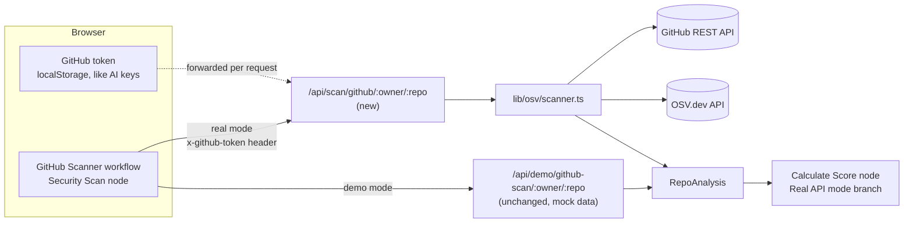
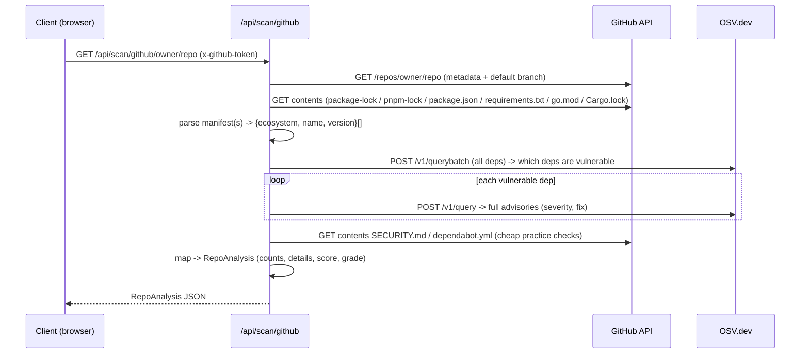

# Design: Real Vulnerability Scanning (OSV-powered) for the GitHub Security Scanner

| | |
|---|---|
| **Status** | Proposed / proof-of-concept (initial backend + docs) |
| **Owner** | TopFlow |
| **Related** | `docs/architecture/architecture-overview.md`, `lib/templates/github-scanner.ts`, `app/api/demo/github-scan/[...repo]/route.ts` |
| **Scope** | Adds a real, opt-in scan path. Demo mode is unchanged. |

---

## 1. Summary

The flagship **GitHub Security Scanner** workflow currently renders **mock** security data
(`lib/demo-data/github-repos.ts`) so it can run instantly with zero setup and without hitting
GitHub API rate limits. This design adds a **real** scanning path that returns live vulnerability
data for any GitHub repository, driven by two free, well-supported data sources:

- **GitHub REST API** — repository metadata + dependency manifests (with the user's own token).
- **[OSV.dev](https://osv.dev)** — Google's Open Source Vulnerabilities database — real CVE/GHSA
  advisories with severity and fix information.

It is a **dual-mode** feature: demo mode remains the default zero-setup showcase, and **real mode**
is opt-in — activated when a user supplies a real repository **and their own GitHub token (BYOK)**.

## 2. Motivation

1. **Credibility.** For a security product, presenting fabricated vulnerabilities (the demo uses
   placeholder CVE IDs such as `CVE-2024-1234`) is a trust liability once users realize results are
   not real. Real data turns the scanner from a visual demo into a genuine tool.
2. **The rate-limit blocker is already solved by BYOK.** `scripts/test-github-api.ts` and
   `scripts/github-api-test-results.md` show the team validated the real GitHub API (~850 ms/repo,
   well under the 30 s budget) but fell back to mock data because the **unauthenticated** limit is
   **60 requests/hour** (~9 calls/scan → ~6 repos before throttling). A user-supplied token raises
   this to **5,000 requests/hour** — so "enter a real repo + your own API key" is exactly the unlock.
3. **The system already anticipates real data.** The workflow's "Calculate Score" node
   (`lib/templates/github-scanner.ts`) already contains a **"Real API mode"** branch that computes a
   weighted score from live vulnerability/dependency/practice/OWASP inputs. This feature simply feeds
   that branch.

## 3. Goals / Non-goals

**Goals**
- Return **real** vulnerability data for a given `owner/repo`, shaped to the existing `RepoAnalysis`
  contract so it flows through the current scoring + visualization unchanged.
- Preserve demo mode exactly as-is (no regression, no setup required).
- Honor the **privacy-first / zero-storage** model: the GitHub token is supplied per request by the
  browser and is **never persisted server-side**.
- Support the most common ecosystems out of the box (npm, PyPI, Go, Cargo).

**Non-goals (this iteration)**
- Replacing demo mode.
- Full OWASP Top-10 automated assessment (only A06 "Vulnerable & Outdated Components" is derived
  from real data; the rest require SAST/config analysis — future work).
- Deep repo posture checks that require elevated token scopes (branch protection, secret scanning,
  code scanning) — stubbed as `null` and documented as future work.
- UI wiring (token field + real/demo toggle) — specified here, implemented in a follow-up.

## 4. Background

### 4.1 OSV.dev API vs OSV-Scanner CLI
[`google/osv-scanner`](https://github.com/google/osv-scanner) is a **Go command-line tool** and
cannot run in a browser or a standard serverless function without bundling a binary. The underlying
**OSV.dev HTTP API** (`https://api.osv.dev`) is the browser/serverless-friendly equivalent, is free,
and **requires no key**. We use the API directly:

- `POST /v1/querybatch` — batch many `{package, version}` queries in one call; returns vuln **IDs**
  per package (used to find *which* dependencies are vulnerable).
- `POST /v1/query` — single `{package, version}`; returns **full** advisory objects (severity,
  summary, fixed versions). Called only for the (usually few) vulnerable packages.

### 4.2 The `RepoAnalysis` contract
Defined in `lib/demo-data/github-repos.ts` and consumed by the workflow's score node. The fields the
real scan populates: `repository, stars, forks, language, securityScore, grade, vulnerabilities
{critical, high, medium, low, details[]}, dependencyAudit {total, vulnerable, ...}, securityPractices
{...}, owaspCompliance {...}`.

## 5. Architecture

Demo mode is untouched; real mode is an additive sibling route.

### 5.1 Components
- **`app/api/scan/github/[...repo]/route.ts`** — Next.js route (Node runtime, `maxDuration = 30`).
  Mirrors the demo route's signature. Reads the BYOK token from the `x-github-token` header (or
  `Authorization: Bearer`), with a server `GITHUB_TOKEN` env fallback for self-hosting. Returns the
  scan result with `Cache-Control: no-store`.
- **`lib/osv/scanner.ts`** — framework-agnostic scan engine: GitHub client, manifest parsers, OSV
  client, severity model, and the `RepoAnalysis` mapping. Pure helpers are exported for unit tests.

## 6. Data flow

### 6.1 Manifest discovery & precedence
Candidates are probed in order; a real **lockfile is preferred** over `package.json` (lockfiles
include transitive dependencies — far better coverage). Supported:

| Ecosystem | Files | Notes |
|---|---|---|
| npm | `package-lock.json`, `pnpm-lock.yaml`, `package.json` | lockfile preferred; `package.json` ranges resolved to a concrete version as a fallback |
| PyPI | `requirements.txt` | `name==version` pins |
| Go | `go.mod` | `require` block |
| Cargo | `Cargo.lock` | `[[package]]` blocks |

Files larger than the contents API's 1 MB inline limit are fetched via their `download_url`.

## 7. Severity model

Each advisory is mapped to one of `CRITICAL | HIGH | MEDIUM | LOW`:

1. **Prefer the GHSA rating** (`database_specific.severity`): `CRITICAL→CRITICAL`, `HIGH→HIGH`,
   `MODERATE→MEDIUM`, `LOW→LOW`.
2. **Fallback to CVSS:** parse the v3.x vector from `severity[]`, compute the base score
   (`cvss3Base`), and band it: `≥9 CRITICAL`, `≥7 HIGH`, `≥4 MEDIUM`, else `LOW`.
3. **Default:** `MEDIUM` (conservative) when neither is present.

## 8. Scoring

Reuses the existing "Real API mode" weights so demo and real outputs are comparable:
`vulnerability 35% · dependency 25% · practices 25% · OWASP 15%`. The route returns a fully-computed
`securityScore`/`grade`, but because the output conforms to `RepoAnalysis`, the workflow's score node
can equally recompute it — no downstream change is required either way.

## 9. Security & privacy

- **BYOK, no server storage.** The token is read from a request header that the browser sends from
  `localStorage` (the same pattern as AI provider keys). It is used only for the duration of the
  request and never written to disk, logs, or a database — consistent with TopFlow's zero-storage
  model and Layer 5 (BYOK) of the documented defense.
- **Fixed egress allowlist (SSRF-safe).** The scanner only ever calls `api.github.com`,
  `api.osv.dev`, and GitHub-issued `download_url`s (raw.githubusercontent.com). User input is limited
  to `owner/repo` path segments — it never forms an arbitrary outbound URL, so this path does not
  widen the HTTP-node SSRF surface discussed in the architecture overview.
- **No code execution.** Scanning reads and parses manifests only; it never executes repository code.
- **Least privilege.** A read-only token (public repos: `public_repo`; private: `repo`) is
  sufficient. Elevated posture checks are deferred rather than demanding broad scopes.

## 10. Error handling

| Case | Behavior |
|---|---|
| Repo not found / private without token | `502` with an actionable message |
| GitHub `403` (rate limit / forbidden) | Error advises supplying a token (or that the limit is hit) |
| No parseable manifest | `500` "No parseable dependency manifest found" |
| OSV/network failure | Surfaced as a `500/502`; never silently faked |
| Malformed `owner/repo` | `400` |

## 11. Alternatives considered

- **GitHub Dependency Graph / Dependabot alerts API.** Gives GitHub-curated alerts but requires the
  repo to have the graph enabled and the token to have alert-read scope; coverage varies and it's
  GitHub-specific. OSV is source-agnostic, deterministic from the lockfile, and key-free. *(Good
  future enrichment, not the primary source.)*
- **Bundling `osv-scanner` (Go) in a serverless function.** Heavier cold starts and packaging;
  unnecessary when the HTTP API returns the same advisory data.
- **Client-side-only scanning.** A user token in pure client code is exposed to any loaded script;
  routing through the API route keeps the token in a single request header and centralizes egress.

## 12. Rollout

Standard `feature → dev → main` flow. Backend + docs land first (this PR, into `dev`). A follow-up
adds the UI (token field + real/demo toggle) and points the workflow's Security Scan node at the real
endpoint in real mode. Demo mode remains the default throughout.

## 13. Future work

Transitive coverage via lockfiles for all ecosystems; additional parsers (`yarn.lock`,
`Pipfile.lock`, `poetry.lock`, `composer.lock`, `Gemfile.lock`); populate `dependencyAudit.outdated`
(registry lookups) and real `securityPractices` (branch protection, secret/code scanning via the
GitHub security APIs); short-TTL caching keyed by repo + commit SHA; surface CVE links + CVSS scores
in the results UI; broaden OWASP mapping; a GitHub Action / PR-comment bot reusing `lib/osv/scanner.ts`.
