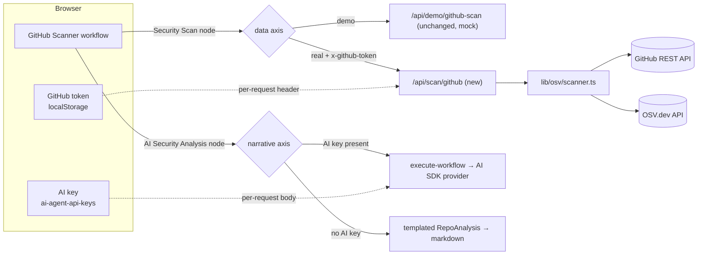
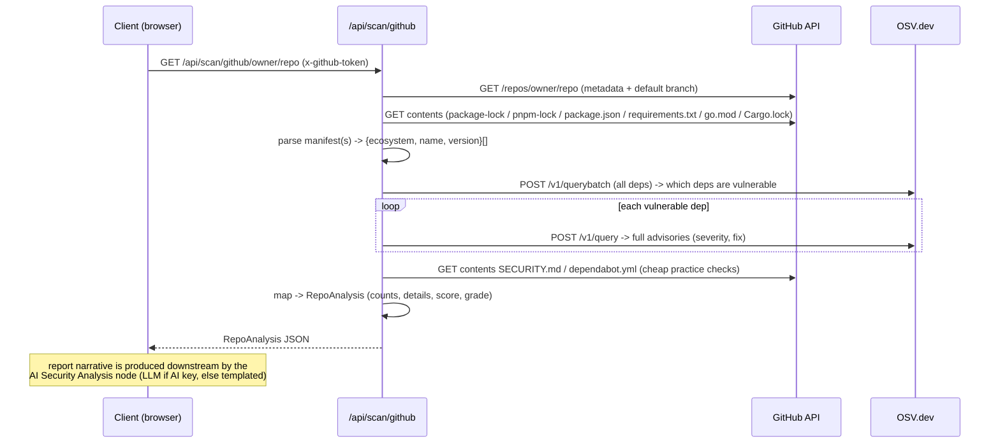

# Design: Real Vulnerability Scanning (OSV-powered) for the GitHub Security Scanner

| | |
|---|---|
| **Status** | Proposed / proof-of-concept (initial backend + docs) |
| **Owner** | TopFlow |
| **Related** | `docs/architecture/architecture-overview.md`, `lib/templates/github-scanner.ts`, `lib/demo-mode.ts`, `lib/topflow-execution-engine.ts`, `app/api/demo/github-scan/[...repo]/route.ts` |
| **Scope** | Adds a real, opt-in scan path. Demo mode is unchanged. |

---

## 1. Summary

The flagship **GitHub Security Scanner** workflow currently renders **mock** security data
(`lib/demo-data/github-repos.ts`) so it can run instantly with zero setup and without hitting
GitHub API rate limits. This design adds a **real** scanning path driven by two free data sources:

- **GitHub REST API** — repository metadata + dependency manifests (with the user's own token).
- **[OSV.dev](https://osv.dev)** — Google's Open Source Vulnerabilities database — real CVE/GHSA
  advisories with severity and fix information.

It is **dual-mode**: demo mode remains the default zero-setup showcase, and **real mode** is opt-in.
Crucially, "bring your own key" in TopFlow means **two independent keys on two independent axes**
(see §6):

- a **GitHub token** controls the **scan-data** axis (real vs mock vulnerabilities), and
- an **AI provider key** controls the **report-narrative** axis (LLM-written vs templated report).

The complete real experience is **real OSV data → real LLM-authored report**, but each axis degrades
gracefully on its own.

## 2. Motivation

1. **Credibility.** For a security product, presenting fabricated vulnerabilities (the demo uses
   placeholder CVE IDs such as `CVE-2024-1234`) is a trust liability once users realize results are
   not real. Real data turns the scanner from a visual demo into a genuine tool.
2. **The rate-limit blocker is already solved by BYOK.** `scripts/test-github-api.ts` and
   `scripts/github-api-test-results.md` show the team validated the real GitHub API (~850 ms/repo,
   well under the 30 s budget) but fell back to mock data because the **unauthenticated** limit is
   **60 requests/hour** (~9 calls/scan → ~6 repos before throttling). A user-supplied token raises
   this to **5,000 requests/hour** — so "enter a real repo + your own GitHub token" is exactly the unlock.
3. **The system already anticipates real data.** The workflow's "Calculate Score" node already has a
   **"Real API mode"** branch that computes a weighted score from live inputs. This feature feeds it.

## 3. Goals / Non-goals

**Goals**
- Return **real** vulnerability data for a given `owner/repo`, shaped to the existing `RepoAnalysis`
  contract so it flows through the current scoring + visualization unchanged.
- Preserve demo mode exactly as-is (no regression, no setup required).
- Define a coherent **two-axis BYOK model** so the GitHub token and the AI key are handled
  independently, and each axis degrades gracefully (§6).
- Honor the **privacy-first / zero-storage** model: both keys are supplied per request by the
  browser and are **never persisted server-side**.
- Support the most common ecosystems out of the box (npm, PyPI, Go, Cargo).

**Non-goals (this iteration)**
- Replacing demo mode.
- Full OWASP Top-10 automated assessment (only A06 "Vulnerable & Outdated Components" is derived
  from real data; the rest require SAST/config analysis — future work).
- Deep repo posture checks needing elevated token scopes (branch protection, secret/code scanning) —
  stubbed `null` and documented as future work.
- The **code implementation** of the decoupled gating, provider-agnostic report model, and templated
  fallback described in §6 — those are specified here and land in a follow-up PR. This PR delivers
  the scan-data engine (`lib/osv/scanner.ts`) + the real endpoint + docs.

## 4. Background

### 4.1 OSV.dev API vs OSV-Scanner CLI
[`google/osv-scanner`](https://github.com/google/osv-scanner) is a **Go command-line tool** and
cannot run in a browser or a standard serverless function without bundling a binary. The underlying
**OSV.dev HTTP API** (`https://api.osv.dev`) is the browser/serverless-friendly equivalent, is free,
and **requires no key**. We use the API directly:

- `POST /v1/querybatch` — batch many `{package, version}` queries in one call; returns vuln **IDs**
  per package (used to find *which* dependencies are vulnerable).
- `POST /v1/query` — single `{package, version}`; returns **full** advisory objects (severity,
  summary, fixed versions). Called only for the (usually few) vulnerable packages.

### 4.2 The `RepoAnalysis` contract
Defined in `lib/demo-data/github-repos.ts` and consumed by the workflow's score node. The fields the
real scan populates: `repository, stars, forks, language, securityScore, grade, vulnerabilities
{critical, high, medium, low, details[]}, dependencyAudit {total, vulnerable, ...}, securityPractices
{...}, owaspCompliance {...}`.

### 4.3 How BYOK + execution work today (verified on `dev`)
- **AI keys** are entered in `components/api-settings-dialog.tsx` and stored in
  `localStorage["ai-agent-api-keys"]` as `{ openai?, anthropic?, google?, groq? }`.
- Execution is **server-side**: the builder POSTs `{ nodes, edges, apiKeys, workflowId, userInputs }`
  to `/api/execute-workflow`. The keys travel in the request **body** (used in-memory, **not stored**).
- `lib/demo-mode.ts › shouldUseDemoMode(apiKeys, workflowId, pref="auto")` decides mock vs live:
  in `auto`, **no AI key → demo**, **any AI key → live**. Explicit `"demo"`/`"live"` override exists.
- `lib/topflow-execution-engine.ts`: in demo mode the scanner short-circuits to
  `getGitHubScannerMockResponse` (no LLM, no real fetch). In live mode, text-model nodes resolve a
  provider via `getModel(modelId, apiKeys)` → AI SDK `createOpenAI/createAnthropic/…` → `generateText`.
- **Today's gap:** even in live mode the "Security Scan" node still targets `/api/demo/github-scan`,
  so a real LLM writes a report about **mock** vulnerabilities. This feature closes that gap.

## 5. Architecture

Demo mode is untouched; real mode is an additive sibling route, and the two BYOK axes are wired to
the two relevant nodes.

### 5.1 Components
- **`app/api/scan/github/[...repo]/route.ts`** — Next.js route (Node runtime, `maxDuration = 30`).
  Mirrors the demo route's signature. Reads the BYOK GitHub token from the `x-github-token` header
  (or `Authorization: Bearer`), with a server `GITHUB_TOKEN` env fallback for self-hosting. Returns
  the scan result with `Cache-Control: no-store`.
- **`lib/osv/scanner.ts`** — framework-agnostic scan engine: GitHub client, manifest parsers, OSV
  client, severity model, and the `RepoAnalysis` mapping. Pure helpers exported for unit tests.

## 6. BYOK model: two keys, two axes

"Bring your own key" covers **two independent keys** that gate **two independent axes** of the
scanner. They must be treated separately — neither implies the other.

| Axis | Key | Drives | Transport | Without the key |
|---|---|---|---|---|
| **Scan data** | **GitHub token** | the `Security Scan` httpRequest node → `/api/scan/github` | `x-github-token` request header (never stored) | real scan still works on **public** repos at 60 req/hr; **private** repos + 5,000 req/hr need the token |
| **Report narrative** | **AI provider key** | the `AI Security Analysis` text-model node | `apiKeys` in the `/api/execute-workflow` body (never stored) | fall back to a **templated** (no-LLM) report rendered from `RepoAnalysis` |

### 6.1 Decoupled gating
Today `shouldUseDemoMode` returns one boolean for the whole workflow, keyed **only** on the AI key —
so a GitHub token alone cannot trigger a real scan, and the data/narrative decisions are conflated.
The target design splits the decision **per axis**:

- **Scan-data axis = real** when a GitHub token is present **or** the user explicitly selects real
  mode (a public-repo real scan needs no token; it simply runs at the lower rate limit). Otherwise
  mock data.
- **Narrative axis = LLM** when any AI provider key is present; otherwise the templated report.

The resulting behavior matrix (an explicit demo/real toggle can always override):

| GitHub token | AI key | Scan data | Report | Effective mode |
|:---:|:---:|---|---|---|
| – | – | mock (`/api/demo/github-scan`) | templated mock | **Demo** (zero-setup, today's default) |
| – | ✓ | real on public repos (60/hr) | real LLM | Live narrative, public data |
| ✓ | – | **real** (public + private, 5,000/hr) | **templated** (no LLM) | Real scan, no AI key needed |
| ✓ | ✓ | **real** | **real LLM** | **Fully real** |

Implementation sketch (follow-up PR): extend `shouldUseDemoMode` (or add a scanner-specific resolver)
to accept the GitHub token / a `scanMode` preference and return a **per-axis** decision; the Security
Scan node chooses its endpoint from the data-axis decision, and the AI node chooses LLM-vs-template
from the narrative-axis decision.

### 6.2 Provider-agnostic report model
The scanner template hardcodes `model: "openai/gpt-4o-mini"`. Because `getModel` throws if that exact
provider key is missing, an **Anthropic-only** user passes the "any key" gate but the report node
fails with *"OpenAI API key not configured."* The report model must be **provider-agnostic**: pick
whichever provider the user actually has a key for (e.g. priority `anthropic → openai → google →
groq`, mapping to a sensible default model per provider), rather than a fixed model string.

### 6.3 Templated (no-LLM) report fallback
A real scan should not *require* an AI key. When scan data is real but no AI key is present, render
the report deterministically from `RepoAnalysis` — exactly the approach `getGitHubScannerMockResponse`
already uses to synthesize report markdown from counts/practices/recommendations. This is factored
into a small shared `renderReport(analysis)` helper so both the templated path and the demo path use
the same renderer, and the LLM path is reserved for the richer narrative when a key is available.

## 7. Data flow

The scan endpoint returns **data only**. The human-readable report is produced **downstream** by the
narrative axis (§6) — this separation is what lets the two BYOK keys vary independently.

### 7.1 Manifest discovery & precedence
Candidates are probed in order; a real **lockfile is preferred** over `package.json` (lockfiles
include transitive dependencies — far better coverage). Supported:

| Ecosystem | Files | Notes |
|---|---|---|
| npm | `package-lock.json`, `pnpm-lock.yaml`, `package.json` | lockfile preferred; `package.json` ranges resolved to a concrete version as a fallback |
| PyPI | `requirements.txt` | `name==version` pins |
| Go | `go.mod` | `require` block |
| Cargo | `Cargo.lock` | `[[package]]` blocks |

Files larger than the contents API's 1 MB inline limit are fetched via their `download_url`.

## 8. Severity model

Each advisory is mapped to one of `CRITICAL | HIGH | MEDIUM | LOW`:

1. **Prefer the GHSA rating** (`database_specific.severity`): `CRITICAL→CRITICAL`, `HIGH→HIGH`,
   `MODERATE→MEDIUM`, `LOW→LOW`.
2. **Fallback to CVSS:** parse the v3.x vector from `severity[]`, compute the base score
   (`cvss3Base`), and band it: `≥9 CRITICAL`, `≥7 HIGH`, `≥4 MEDIUM`, else `LOW`.
3. **Default:** `MEDIUM` (conservative) when neither is present.

## 9. Scoring

Reuses the existing "Real API mode" weights so demo and real outputs are comparable:
`vulnerability 35% · dependency 25% · practices 25% · OWASP 15%`. Scoring is independent of the
narrative axis — the score is computed from the scan data whether the report is LLM-written or
templated. Because output conforms to `RepoAnalysis`, the workflow's score node can equally recompute
it; no downstream change is required either way.

## 10. Security & privacy

- **Two BYOK keys, neither stored.** The **GitHub token** arrives in a request header
  (`x-github-token`) and the **AI key** in the `execute-workflow` body; both are used only for the
  duration of the request and never written to disk, logs, or a database — consistent with the
  zero-storage model and Layer 5 (BYOK) of the documented defense. Note that live execution is
  server-side, so both keys *transit* the serverless function (in memory); they are not persisted.
- **Fixed egress allowlist (SSRF-safe).** The scanner only ever calls `api.github.com`,
  `api.osv.dev`, and GitHub-issued `download_url`s (raw.githubusercontent.com). User input is limited
  to `owner/repo` path segments — it never forms an arbitrary outbound URL, so this path does not
  widen the HTTP-node SSRF surface discussed in the architecture overview.
- **No code execution.** Scanning reads and parses manifests only; it never executes repository code.
- **Least privilege.** A read-only token (public repos: `public_repo`; private: `repo`) is
  sufficient. Elevated posture checks are deferred rather than demanding broad scopes.
- **Claims to reconcile (tracked under the P0 security-integrity item):** the API-settings dialog
  states keys are "encrypted in your browser" (storage is currently plain `localStorage`), and the
  README states keys "never touch our servers" (they are POSTed to the serverless function on live
  runs). These should be corrected or implemented; they are out of scope for this feature but noted
  because this feature adds a second key to the same flow.

## 11. Error handling

| Case | Behavior |
|---|---|
| Repo not found / private without token | `502` with an actionable message |
| GitHub `403` (rate limit / forbidden) | Error advises supplying a token (or that the limit is hit) |
| No parseable manifest | `500` "No parseable dependency manifest found" |
| OSV/network failure | Surfaced as a `500/502`; never silently faked |
| Malformed `owner/repo` | `400` |
| Real data but no AI key | Not an error — narrative axis falls back to the templated report (§6.3) |

## 12. Alternatives considered

- **GitHub Dependency Graph / Dependabot alerts API.** Gives GitHub-curated alerts but requires the
  graph enabled and alert-read scope; coverage varies and it's GitHub-specific. OSV is source-
  agnostic, deterministic from the lockfile, and key-free. *(Good future enrichment, not primary.)*
- **Bundling `osv-scanner` (Go) in a serverless function.** Heavier cold starts and packaging;
  unnecessary when the HTTP API returns the same advisory data.
- **Client-side-only scanning.** A user token in pure client code is exposed to any loaded script;
  routing through the API route keeps the token in a single request header and centralizes egress.

## 13. Rollout

Standard `feature → dev → main` flow. Backend + docs land first (this PR, into `dev`). A follow-up
implements §6 (decoupled gating, provider-agnostic report model, templated fallback) and the UI:
a **GitHub-token field** (scan-data axis) alongside the existing **AI-key settings** (narrative
axis), plus a demo/real toggle, and points the Security Scan node at the real endpoint in real mode.
Demo mode remains the default throughout.

## 14. Future work

Implement §6 (decoupled per-axis gating, provider-agnostic report model, shared `renderReport`
templated fallback); transitive coverage via lockfiles for all ecosystems; additional parsers
(`yarn.lock`, `Pipfile.lock`, `poetry.lock`, `composer.lock`, `Gemfile.lock`); populate
`dependencyAudit.outdated` (registry lookups) and real `securityPractices` (branch protection,
secret/code scanning via the GitHub security APIs); short-TTL caching keyed by repo + commit SHA;
surface CVE links + CVSS scores in the results UI; broaden OWASP mapping; a GitHub Action /
PR-comment bot reusing `lib/osv/scanner.ts`.
