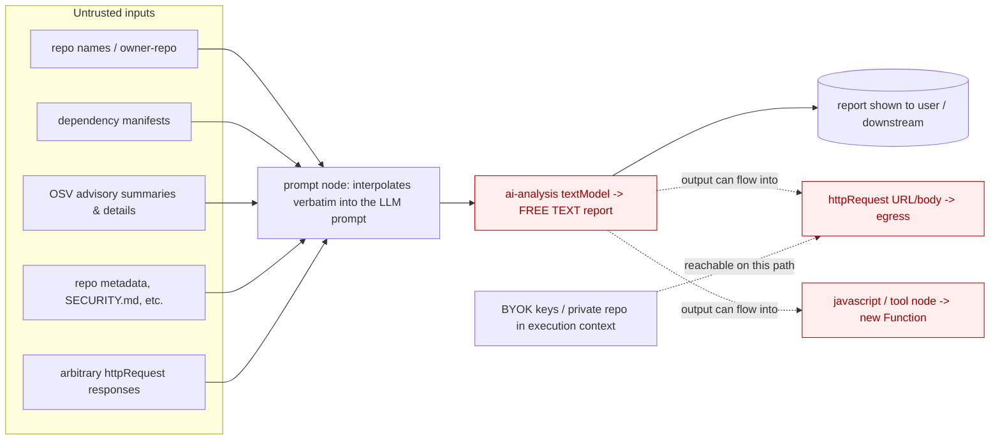

# Design: Applying the URW (Untrusted Reasoning Worker) Framework to TopFlow's LLM Pipeline

| | |
|---|---|
| **Status** | Proposed (design) |
| **Owner** | TopFlow |
| **Related** | `lib/topflow-execution-engine.ts`, `lib/templates/github-scanner.ts`, `lib/demo-mode.ts` (`renderReport`), `lib/osv/scanner.ts`, `app/api/execute-workflow/route.ts`, `lib/security/validation-engine.ts`, `docs/architecture/architecture-overview.md`, `docs/architecture/osv-real-scan-design.md` |
| **Scope** | How the LLM-enabled pipeline should be restructured so high-stakes (security/compliance) workflows have hard trust guarantees. Does **not** propose changing the open-ended builder's creative use. |

---

## 1. Summary

TopFlow is a security product built around an LLM workflow engine. Two facts make trust — not
capability — the binding constraint:

1. The flagship GitHub Scanner produces a **security report**: fabrication is unacceptable (it
   already shipped placeholder CVE IDs in demo data), and every claim must be traceable.
2. The generic engine is, by construction, a **general-purpose agent**: it lets an LLM read
   untrusted content and influence consequential sinks (outbound HTTP, JS execution). The research
   consensus URW summarizes is that general-purpose agents **cannot** be made robust to prompt
   injection — you must build *restricted* agents for the high-stakes paths.

**The URW move for TopFlow:** demote the LLM on consequential paths from **author** to
**constrained selector**. The model reasons over a *minimized view* of a validated
source-of-truth and emits **only structured, schema-checked, existence-validated tokens** (finding
IDs, enums). Deterministic code then **assembles** the artifact verbatim from the selected IDs, and
any outward side effect is **human-gated**. We already built the assembler — `renderReport()` —
when we added the templated (no-LLM) report path; URW reframes that as the *trusted* output path
and constrains the LLM around it.

URW is **one layer for the high-stakes templates**, not a replacement for the open-ended builder
(§8). It composes with the separate "5-layer defense" hardening tracked under the P0
security-integrity work.

## 2. Why this matters for TopFlow (the trust gap)

- **Confabulation is a product-killing bug here.** A security report that invents a CVE, severity,
  or "fix" is worse than no report. The real-scan work (OSV) fixed the *source*; URW fixes the
  *path* so the model can't reintroduce fabrication downstream.
- **The lethal trifecta is present.** A scan combines **private data** (the user's BYOK GitHub/AI
  keys; private-repo contents) + **untrusted content** (scanned manifests, package names, OSV
  advisory prose, arbitrary `httpRequest` responses) + **external communication** (outbound
  `httpRequest` nodes). Today nothing stops a graph of: *fetch attacker-controlled content → LLM →
  `httpRequest` POST to an attacker URL* — i.e. exfiltration of keys or private code via indirect
  prompt injection.
- **Trust is the brand.** A former-CISO product advertising "enterprise-grade security" needs
  demonstrable, auditable guarantees on its own AI pipeline, not just on the repos it scans.

## 3. Threat model — where untrusted content & the trifecta live today



Entry points (untrusted → model, today, as *instructions* not just data):
- **Prompt interpolation.** `executePromptNode` substitutes `$input1.fullName`, scan fields, etc.
  verbatim into the prompt. A repo named `x/y") ignore prior instructions; …` or an OSV `summary`
  carrying injection text lands directly in the model's instruction stream (OWASP **LLM01**,
  indirect).
- **`httpRequest` node** fetches arbitrary URLs; the body/text becomes node output that can feed a
  prompt (untrusted content) **and** can carry interpolated LLM output outbound (improper output
  handling, **LLM05**, + egress).
- **`tool`/`javascript` node** runs `new Function(code)`; LLM output flowing into a JS node is a
  code-execution sink.
- **`structuredOutput`** uses `generateObject` + Zod (good), but its template schema is permissive
  (free-text `string` fields), so quarantined untrusted text can pass through as model-authored
  prose, and it sits *downstream of* the free-text analysis.

## 4. Current pipeline vs the seven URW invariants

| # | Invariant | Today | Gap |
|---|---|---|---|
| 1 | **Source-of-truth authority** | Partial. Real mode grounds data in OSV/GitHub via `scanner.ts`; but the `ai-analysis` LLM writes free prose that can add ungrounded claims. | The narrative is not constrained to traceable IDs. |
| 2 | **Constrained elicitation** | Violated on the consequential path. `ai-analysis` emits **free text** that *is* the report. `structuredOutput` is schema-bound but downstream and permissive. | LLM free text is the product output. |
| 3 | **Existence validation** | Absent. Nothing checks that CVE/GHSA IDs the model mentions actually exist in the scan result. | No fail-closed ID verification. |
| 4 | **Deterministic assembly** | Foundation exists: `renderReport()` assembles from `RepoAnalysis` (templated path). LLM path lets the model assemble. | Assembly not enforced for the LLM path. |
| 5 | **Trust classification of inputs** | Absent. Untrusted scan/HTTP content is interpolated into prompts as if trusted. | No quarantine; data can act as instructions. |
| 6 | **Least-privilege, human-gated side effects** | Absent. LLM output can reach `httpRequest`/`tool` sinks with no gate; `validateWorkflow` does SSRF/cycle checks (coverage flagged as incomplete in the impl guide), but side effects are still model-influenced. | No human gate; trifecta open. |
| 7 | **Observability** | Minimal. Scattered `console.log`; no structured, auditable selection/validation/action trace. | No audit record. |

## 5. The redesign

### 5.1 Two execution profiles (trust tiers)

Introduce an explicit `executionProfile` on a workflow/template:

- **Open** (default for the general builder): today's behavior, clearly labeled as an untrusted,
  creative agent. Subject only to the trifecta guard (§5.3) — not the full URW restraint.
- **Restricted / URW** (default for the 8 security & compliance templates: GitHub scanner, GDPR,
  PII detection, incident response, SOC 2 evidence, threat-intel): enforces invariants 1–7. LLM
  output on consequential paths must be structured + validated; artifacts are assembled by code;
  outward side effects are human-gated.

The profile is set by the template and surfaced in the UI; the engine reads it from the
execute-workflow request alongside the existing `scanMode`/keys.

### 5.2 The URW GitHub-Scanner pipeline

```mermaid
flowchart LR
  subgraph TRUSTED
    SOT[(Validated ScanResult\nfindings w/ real CVE/GHSA IDs)]
    MIN[minimized view\nids + severity + flags + score]
    VAL[existence validation\nselected ids ⊆ known ids? else drop / fail closed]
    ASM[renderReport\ndeterministic assembly, verbatim]
    AUD[(audit trace)]
  end
  subgraph UNTRUSTED
    LLM[LLM: constrained elicitation\nstructured tokens ONLY]
  end
  SOT --> MIN --> LLM --> VAL --> ASM --> OUT[(report)]
  LLM -. optional, non-authoritative .-> NOTE[labeled \"AI commentary\"\nno IDs/severities/numbers]
  ASM --> AUD
```

Concretely, the `ai-analysis` node in `lib/templates/github-scanner.ts` changes role:

1. **Minimized view (invariant 5).** It receives the validated `ScanResult` reduced to
   `{ findings: [{id, severity, component, fixAvailable}], practices, score }` — **not** raw
   advisory prose or repo strings. Any untrusted text that must be shown is passed inside a clearly
   delimited *data* block the schema cannot echo back as instructions; control characters stripped.
2. **Constrained elicitation (invariants 1–2).** Use `generateObject` + a **tight** Zod schema, e.g.
   ```ts
   z.object({
     prioritizedFindingIds: z.array(z.string()),           // must be a subset of provided IDs
     recommendations: z.array(z.object({
       findingId: z.string(),
       effort: z.enum(["5 minutes","15 minutes","30+ minutes"]),
       impact: z.enum(["low","medium","high","critical"]),
     })),
     summaryLabel: z.enum(["excellent","strong","needs-improvement","at-risk"]),
   })
   ```
   No free-text fact fields. (Replaces the current permissive string schema.)
3. **Existence validation (invariant 3).** Trusted code intersects every returned `findingId`
   against the known ID set from `scanner.ts`; unknown IDs are dropped and logged; if the model
   returns only unknowns, **fail closed** to the deterministic default ordering.
4. **Deterministic assembly (invariant 4).** `renderReport(scanResult, { order, recommendations })`
   builds the final report verbatim from the validated findings in the model's chosen order +
   selected recommendation templates. The model *ranks/selects*; code *writes*.
5. **Optional advisory narrative.** A separate, clearly-labeled "AI commentary" section may be
   generated, but it is **non-authoritative**: it must contain no CVE IDs, severities, or numbers
   (those are stripped/validated out), and it is never the source of a reported fact.
6. **Audit record (invariant 7).** Emit `{ providedIds, selectedIds, droppedIds, schemaValid,
   assembledFrom, model, profile }` to the execution trace.

Net effect: the report's facts are **always** the OSV/GitHub source-of-truth; the LLM can only
reorder, prioritize, and add labeled color. Injection in a package name or advisory cannot change a
CVE, a count, or trigger an action — at worst it nudges ordering, which the audit trail exposes.

### 5.3 Breaking the lethal trifecta in the engine

Independent of profile, add a **graph-level trifecta guard** to the engine / `validation-engine.ts`:

- Classify each node: *reads untrusted content* (`httpRequest`, real scan), *holds/【exposes】private
  data* (uses BYOK keys / private-repo data), *performs external comms* (`httpRequest` with
  method≠GET or non-allowlisted host; future email/webhook nodes).
- If a single execution path combines all three **with an LLM in between**, require a **human gate**
  (§5.4) or block in the Restricted profile.
- **Keep credentials out of the model's reach.** `apiKeys`/tokens must never be in the variable
  namespace that `prompt`/`httpRequest` interpolation can read or echo (today they aren't — lock
  that in with a test).
- **Treat LLM output as untrusted into sinks (LLM05).** When a model's output flows into a
  `httpRequest` URL/body or a `javascript`/`tool` node, validate/escape it and (Restricted) gate it.

### 5.4 Human-gated, observable side effects

- Outward/irreversible actions downstream of an untrusted-fed LLM present a **small, legible diff**
  for human approval (e.g. "POST these 3 fields to host X?") rather than firing automatically.
- The roadmap's **execution history / timeline debugger** is the natural substrate for invariant 7:
  persist the per-node audit records (selections, validations, gate decisions) as the run trace.
- An **advisory evaluator** (LLM scoring report quality) may annotate the run but is **never in the
  blocking path**.

## 6. Threats covered (mapped)

| Threat (source) | How the URW redesign addresses it |
|---|---|
| Confabulation / hallucination (NIST AI 600-1) | Facts come only from the validated source; IDs existence-checked; fail closed. |
| Direct + indirect prompt injection (OWASP LLM01) | Untrusted content is quarantined as data over a minimized view; model emits structured tokens only. |
| Improper output handling (LLM05) | Model output is structured + validated before any sink; treated as untrusted into HTTP/JS. |
| Lethal trifecta | Graph guard + human gate sever private-data + untrusted-content + egress on one path. |
| Excessive agency (OWASP/SAIF) | LLM selects; code/human acts. No model-triggered side effects. |
| Data over-exposure | Minimized view; credentials kept out of model reach. |

## 7. What URW does **not** cover here

Model jailbreaks, training/supply-chain poisoning, DoS, and the **correctness of the
source-of-truth itself** (OSV/GitHub). URW is one layer — combine with input validation,
least-privilege credentials kept out of the model's reach, output-handling hygiene, model-level
safety, and monitoring/IR. These are exactly the items in the P0 "5-layer defense" track; this
design and that one are complementary.

## 8. Where **not** to apply URW

The **Open** profile — ad-hoc, creative, exploratory workflows users build by hand. URW's restraint
(structured-only output, deterministic assembly) is overhead that defeats open-ended generation.
Keep the open builder, label it as an untrusted agent, and protect it only with the trifecta guard
(§5.3) and credential isolation — not the full seven invariants.

## 9. Residual risks (honest)

- **Faithful ≠ true.** Grounding in OSV doesn't make OSV right — curate/refresh the source.
- **Faithful-but-misleading.** The model could prioritize/frame selectively; the audit trail + a
  deterministic default ordering make this reviewable.
- **Quarantine leakage.** If the selection schema grows free-text fields, untrusted text re-enters
  the consequential path — keep the schema tight (IDs/enums only).
- **Human-gate fatigue.** Keep gated diffs small and legible; only gate true trifecta paths.
- **Injection defense is strong, not perfect.** Red-team the minimized view + schema; defense in
  depth.

## 10. Phased adoption (maps to files)

- **Phase 1 — Scanner to full URW.** Replace the `ai-analysis` free-text node with the constrained
  selection schema + existence validation, and route assembly through `renderReport`. *Most of the
  assembler already exists.* Files: `lib/templates/github-scanner.ts`,
  `lib/topflow-execution-engine.ts` (textModel/structuredOutput handling), `lib/demo-mode.ts`
  (`renderReport` gains an `order`/`recommendations` arg), `lib/osv/scanner.ts` (export the known-ID
  set).
- **Phase 2 — Trifecta guard + human gate.** Add node trust-classification and the path check to
  `lib/security/validation-engine.ts` + `app/api/execute-workflow/route.ts`; add an approval step
  to the engine for gated sinks.
- **Phase 3 — Profiles, audit trail, advisory evaluator.** Add `executionProfile` end-to-end;
  persist per-node audit records into the execution-history feature; add the non-blocking evaluator.

## 11. Acceptance criteria

A scan is URW-compliant when: (a) no free-text model output appears on the report's factual path;
(b) every CVE/GHSA/finding in the report resolves to an ID present in the validated `ScanResult`;
(c) a prompt-injection payload planted in a package name / OSV summary cannot alter any reported
count, severity, or trigger any outbound request (verified by a red-team fixture); (d) the run emits
an audit record of provided vs. selected vs. dropped IDs; (e) demo mode and the open builder are
unaffected.
