# TopFlow — Security & AI-Trust Development Plan

**Anchor:** the GitHub Security Scanner and the LLM workflow engine behind it.
**Status:** active program plan · **Last updated:** 2026-06-13

This folder consolidates the gaps and next steps identified during the OSV real-scan work into a
**prioritized, sequenced** development program. Each workstream has its own detail doc; this file is
the index, the priority matrix, and the sequencing.

> Companion design docs (the "why" + architecture):
> `docs/architecture/osv-real-scan-design.md` and `docs/architecture/urw-llm-pipeline-design.md`.

---

## 1. Where we are (already shipped / in flight)

| Item | What | State |
|---|---|---|
| Real OSV scanning | `lib/osv/scanner.ts` + `app/api/scan/github/[...repo]` + design/dev docs | PR (feature/osv-real-scan) |
| Per-axis BYOK gating | `resolveScanModes`, `resolveReportModel`, shared `renderReport` | PR (feature/osv-real-scan-gating) |
| UI activation | real/demo toggle + GitHub-token field; sends `githubToken`/`scanMode` | PR (feature/osv-real-scan-ui) |
| CI on dev PRs | `.github/workflows/ci.yml` triggers + blocking type-check | PR (parked: fork Actions enablement) |
| URW design | `docs/architecture/urw-llm-pipeline-design.md` | PR (feature/urw-llm-pipeline-design) |

**Foundations this plan builds on:** the BYOK + dedicated-endpoint pattern (data axis = GitHub token,
narrative axis = AI key), and the deterministic `renderReport()` assembler — which is also the URW
"trusted assembly" primitive.

## 2. Guiding principle: trust before reach

TopFlow's value proposition is **trustworthy security tooling built by a CISO**. Every priority below
is ranked by **trust delivered per unit effort**, not by feature surface. Two truths drive the order:

1. The product's own AI pipeline is currently a general-purpose agent on the **lethal trifecta** (BYOK
   keys/private repos + untrusted scanned content + outbound HTTP). Hardening that is existential.
2. The architecture doc advertises controls the implementation guide lists as **not yet built**.
   Closing that gap (and being honest about status) is the single biggest credibility win.

## 3. Priority matrix

| ID | Workstream | Priority | Effort | Depends on | Detail |
|---|---|:--:|:--:|---|---|
| W1 | 5-layer defense hardening (SSRF, cycles, JS sandbox, rate limit, key encryption) + claims reconciliation | **P0** | L | — | `01-p0-security-hardening.md` |
| W2 | URW trust boundary (Phase 1 scanner → 2 trifecta guard → 3 profiles/audit) | **P0** | L | shares files w/ W1 | `02-p0-urw-trust-boundary.md` |
| W3 | Make a second template real (PII detection; GDPR stretch) | **P1** | M | W2 Phase 1 pattern | `03-p1-second-template.md` |
| W4 | Distribution loop (GitHub Action / PR bot + real README badges + SEO pages) | **P1** | M | real scan endpoint; CI enabled | `04-p1-distribution-loop.md` |
| W5 | Observability / execution history (audit substrate) | P2 | M | W2 | (roadmap Phase 3) |

Effort: **S** < 1 day · **M** 1–3 days · **L** ≥ 1 week.

## 4. Sequencing & milestones

```mermaid
flowchart LR
  M0[M0: land OSV stack + CI] --> M1[M1: trust core]
  M1 --> M2[M2: scale the pattern]
  M2 --> M3[M3: distribution + observability]
  subgraph M1 [M1 — trust core P0]
    W1a[SSRF + cycle detection + rate limit]
    W2a[URW Phase 1: scanner constrained-selector]
    W1b[key encryption + claims reconciliation]
    W2b[URW Phase 2: trifecta guard + human gate]
  end
  subgraph M2 [M2 — scale P1]
    W3a[2nd template real, URW-compliant]
  end
  subgraph M3 [M3 — reach P1/P2]
    W4a[Action / PR bot / real badges]
    W5a[audit trail + execution history]
    W1c[JS sandbox replacement]
  end
```

**Why this order**
- **M1 (trust core)** combines W1 and W2 because they touch the same files
  (`lib/security/validation-engine.ts`, `app/api/execute-workflow/route.ts`,
  `lib/topflow-execution-engine.ts`) — doing them together avoids churn/conflicts. URW Phase 1
  (scanner) is the smallest, highest-value slice and largely extends `renderReport`.
- **JS sandbox replacement (W1c)** is P0 by risk but **L** effort and lands in M3 because it is
  self-contained and shouldn't block the faster trust wins.
- **M2** scales the now-trusted pattern to a second template (URW-compliant from day one).
- **M3** turns the real scanner into a growth engine and adds the audit substrate.

## 5. Cross-cutting concerns (apply to every workstream)

- **Testing:** every control/feature ships with tests. A **prompt-injection red-team fixture**
  (URW acceptance) is shared infrastructure — a synthetic repo/manifest + crafted OSV-style advisory
  carrying injection payloads, asserting counts/severities are unchanged and no outbound request fires.
- **Observability:** route per-node audit records (selections, validations, gate decisions) into the
  roadmap's execution-history/timeline feature (W5).
- **Docs honesty:** keep `architecture-overview.md` status flags (Implemented vs Planned) accurate as
  controls land; fix the README/api-settings claims (see W1).
- **CI:** the workflow exists; enabling fork Actions (parked) unblocks automated validation of all of
  the above.

## 6. Definition of done for the program

A scan (and any security/compliance workflow) is trustworthy when: the documented controls are real
and tested; the LLM cannot fabricate or exfiltrate (URW invariants hold on consequential paths); the
trifecta is severed or human-gated; every run is auditable; and the public-facing claims match the
shipped reality.
